# Architecture

AI Medical Research Assistant is a multi-agent platform: a FastAPI backend
runs fourteen specialized agents against real external data sources
(PubMed, ClinicalTrials.gov, openFDA, RxNav, ChEMBL, Wikipedia,
DuckDuckGo) and a local LLM (Ollama), plus two more agents — Evidence
Synthesis and Citation Verification — that only run as orchestrator
pipeline stages over the others' combined output. A Vite + React frontend
gives each agent its own panel, a Research Dashboard that runs the full
pipeline (with a downloadable Markdown report), a live medical-news feed,
an interactive knowledge-graph explorer, and a floating research
assistant widget (web search + bullet-point summarizer) available on
every page. Everything runs locally by default — no API keys required.

This document is organized as one small flowchart per subsystem rather than
one big diagram, so each part can be read on its own.

## 1. System at a glance

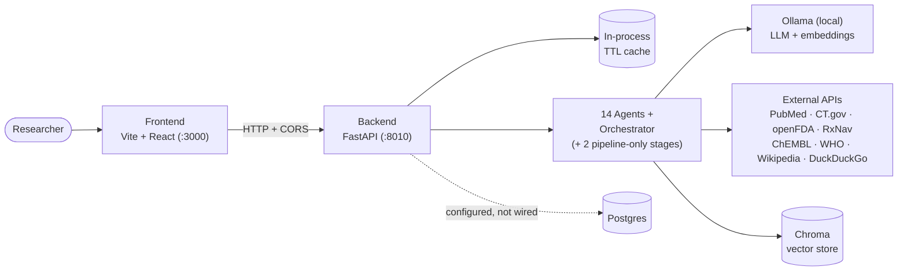

Sections 2–14 below each expand one box from this diagram.

## 2. Frontend

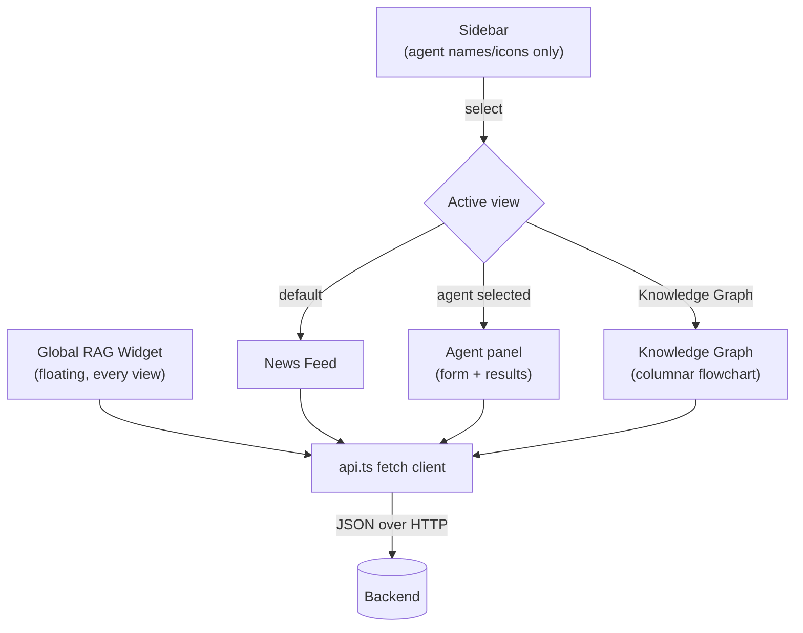

```
frontend/src/
  main.tsx                  Entry point
  App.tsx                   View-switching: "news" | one of 13 agent keys
  api.ts                    Typed fetch client — one function per endpoint
  hooks/useAgentCall.ts     Shared {loading, error, result, run()} state
  utils/reportMarkdown.ts   Serializes a ResearchReportResult to Markdown
                             for the dashboard's downloadable report
  components/
    Sidebar.tsx              Nav only — agent names/icons, no forms
    PanelShell.tsx           Shared card chrome for agent views
    NewsFeed.tsx             3-column news feed, independently scrollable
    GlobalRagWidget.tsx      Floating widget (web search + points
                              summarizer), mounted at App level — visible
                              on every view, not scoped to any one panel
    BackendStatus.tsx        Health-check pill
    panels/
      ResearchDashboardPanel.tsx  Runs the full orchestrator pipeline
      LiteratureReviewPanel.tsx
      PaperAnalyzerPanel.tsx  PMID or pasted text → structured extraction
      DrugDiscoveryPanel.tsx
      SafetyPanel.tsx
      DrugInteractionPanel.tsx  Two-drug label cross-reference
      RegulatoryPanel.tsx  FDA approval history + recalls
      ClinicalTrialsPanel.tsx
      ComparativeAnalysisPanel.tsx  2-4 drugs side-by-side
      CitationGeneratorPanel.tsx
      ResearchSummarizerPanel.tsx
      DocumentUploadPanel.tsx  Upload + RAG Q&A over indexed content
      KnowledgeGraphView.tsx  Columnar layout + hand-rolled SVG
  index.css                 Design tokens (light/dark), layout, styles
public/
  watermark.svg              Tiled medical/pharma iconography, low-opacity
```

Only one view is mounted at a time. Most agent views cap at 760px wide; the
knowledge graph and Research Dashboard opt into a wider 1080px container
(`agent-view-wide`) since a multi-column diagram / multi-section report
needs more room. `GlobalRagWidget` is the one exception to the
one-view-at-a-time model: it's rendered as a sibling of `.app-shell`, not
inside `Router`/`main-content`, so it persists across every view change
instead of being torn down and remounted.

## 3. Backend request pipeline

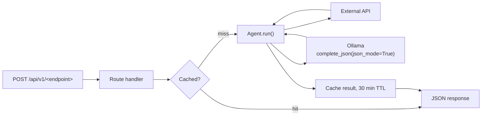

Every agent endpoint shares this same cache wrapper
(`services/cache.py`, keyed by a hash of the request body) — verified to
cut a repeat ~19s request to ~0.1s on a hit.

```
backend/app/
  main.py                    FastAPI app, CORS middleware
  core/config.py             Settings (pydantic-settings, reads .env)
  api/
    router.py                Mounts all route modules under /api/v1
    routes/                  health · research · literature · drugs · trials
                              citations · summarize · documents · news
                              knowledge_graph · safety · regulatory
                              paper_analysis · interactions · comparative
                              rag_tool
  agents/                    base.py (BaseAgent ABC) + one file per agent:
                              literature_review · drug_discovery
                              clinical_trial_analyzer · citation_generator
                              research_summarizer · knowledge_graph · safety
                              document_qa · regulatory · research_paper_analyzer
                              drug_interaction · comparative_analysis
                              web_search_rag · points_summarizer
                              evidence_synthesis (pipeline-only)
                              citation_verification (pipeline-only)
                              orchestrator.py (ResearchPlanner)
  services/
    llm.py                   LLMClient ABC; AnthropicLLMClient, OllamaLLMClient
    embeddings.py             Embedder ABC; HashEmbedder, OllamaEmbedder, SentenceTransformerEmbedder
    vector_store.py          VectorStore ABC; ChromaVectorStore
    external_apis.py         PubMedClient, ClinicalTrialsClient, OpenFDAClient, RxNormClient, ChEMBLClient
    web_search.py            WebSearchClient — Wikipedia search/summary + DuckDuckGo Instant Answer
    citations.py             APA/MLA/Vancouver/IEEE/Nature formatting
    pdf_ingestion.py         PyMuPDF text extraction + RapidOCR fallback
    news.py                  WHO RSS + PubMed recency search, 15-min cache
    cache.py                 Generic in-process TTL cache
  models/schemas.py          Pydantic request/response models
  db/session.py               SQLAlchemy engine/session — configured but unused
```

## 4. The agents

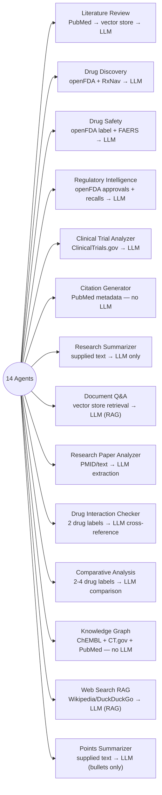

Seven of these — Literature Review, Drug Discovery, Safety, Regulatory,
Clinical Trial Analyzer, Citation Generator, Research Summarizer — take a
single "query" and form the orchestrator's fan-out (below). The remaining
seven have a different input shape (a PMID/text, two drug names, a list of
2-4 drugs, a question, or supplied text/a web query) and are
standalone-only, each accessible via its own frontend panel — or, for Web
Search RAG and Points Summarizer, the floating global widget available on
every page — with no orchestrator integration.

### Orchestrator pipeline

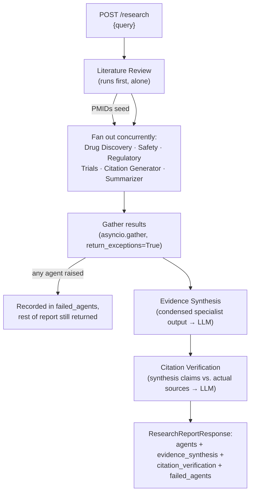

`orchestrator.py` (`ResearchPlanner`, behind `/api/v1/research`, with a
frontend panel — Research Dashboard, which can also export the whole
report as a downloadable Markdown file client-side) runs Literature Review
first so its discovered PMIDs can seed the Citation Generator, fans the
rest out concurrently, then runs two more stages over the combined output:

- **Evidence Synthesis** condenses each specialist agent's narrative
  fields (not full source lists — those would just dilute the prompt) into
  one cross-cutting assessment: consensus points, conflicts, evidence
  strength, research gaps.
- **Citation Verification** checks the synthesis's claims against the
  actual PMIDs/NCT IDs the specialist agents retrieved, and flags anything
  that can't be traced to a real source — verified live: it correctly
  caught a synthesis claim ("topical metformin lotion targets tendon
  tissue...") that had no supporting source and flagged it as unsupported
  rather than letting it through.

Any specialist agent (or either pipeline stage) that raises is caught and
recorded in `failed_agents` rather than failing the whole request —
verified with a deliberately-failing agent: the other agents' results and
both pipeline stages still came back.

## 5. Document ingestion & Q&A (RAG)

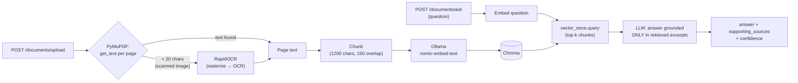

Any page with too little extractable text is treated as a scanned image
and OCR'd (ONNX-based RapidOCR, no system Tesseract install). The same
Chroma collection also holds PubMed abstract chunks Literature Review
indexes (both now store a common `{source, text}` shape), so **Document
Q&A** (`DocumentQAAgent`, `/documents/ask`) retrieves across whichever mix
of uploaded PDFs and indexed literature is available and answers with an
LLM constrained to cite only the retrieved excerpts — this is a real RAG
pipeline, distinct from `/documents/search` which just returns raw
matches with no generation step. Extraction/OCR are CPU-bound, so the
upload route runs them in a thread pool rather than on the event loop.

## 6. Global RAG widget: web search + points summarizer

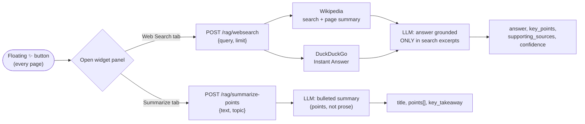

Unlike every other agent, which lives behind one dedicated panel,
`WebSearchRAGAgent` and `PointsSummarizerAgent` are surfaced through a
single floating widget (`GlobalRagWidget.tsx`) mounted as a sibling of
`.app-shell` in `App.tsx` — so it renders on top of whichever view is
active (News Feed or any of the 13 agent panels) instead of being scoped
to one.

- **Web Search tab** (`WebSearchRAGAgent`, `/rag/websearch`) is real
  retrieval-augmented generation over the live web, not the local vector
  store: it queries Wikipedia's search API (plus a DuckDuckGo Instant
  Answer lookup when one resolves) and has the LLM answer using only the
  returned excerpts, explicitly instructed to say so rather than guess if
  they're insufficient. Verified live on "how does metformin lower blood
  sugar": returned a factually correct, grounded-sounding answer — though
  the Wikipedia search matched only loosely-related articles for this
  natural-language phrasing (no direct "Metformin" hit), and the model
  leaned on its own background knowledge rather than declining; it did
  correctly self-report `confidence: "low"`, a partially-honest signal of
  the weak grounding. Known limitation, not fixed: Wikipedia's search
  endpoint favors keyword-style queries over natural-language questions,
  and small local models don't always refuse to answer when instructed to.
- **Summarize tab** (`PointsSummarizerAgent`, `/rag/summarize-points`)
  takes any pasted text and an optional topic, and returns a bulleted list
  (`points: string[]`) plus a one-sentence `key_takeaway` — the system
  prompt explicitly forbids prose paragraphs. Verified live on a metformin
  clinical summary: returned five correct, self-contained bullet points
  and an accurate takeaway.

Both routes share the same 30-minute TTL cache as every other agent
endpoint (`services/cache.py`).

## 7. Research paper analyzer

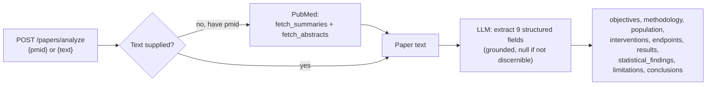

Distinct from Literature Review (which synthesizes *across* many papers):
`ResearchPaperAnalyzerAgent` does a structured single-paper breakdown, and
accepts either a PMID or raw pasted text — so it can analyze a paper (or
an uploaded document's extracted text) that isn't on PubMed at all.
Verified live on two very different real abstracts: a brief virology
discovery report correctly returned mostly `null` for trial-specific
fields (honest, not fabricated) since they didn't apply, while a real RCT
abstract was extracted in full — objectives, 12-week randomized design,
population, dosed interventions, endpoints, results, and statistics
were all pulled out correctly.

## 8. Drug safety & pharmacovigilance

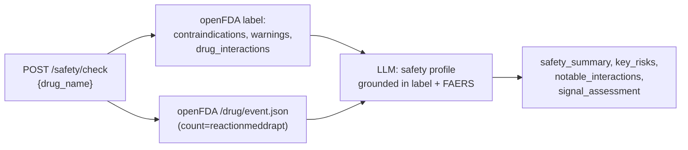

`SafetyAgent` pulls the label's structured safety sections (falling back
from `warnings_and_cautions`/`boxed_warning` to the legacy `warnings` field
for simpler OTC labels) plus the top FAERS-reported adverse-event terms,
aggregated server-side by openFDA rather than fetched as raw case reports.
The system prompt explicitly instructs the model to frame FAERS counts as
unverified voluntary reports, not established causation, and the frontend
repeats that disclaimer — this is a research-support summary, not a
clinical decision tool.

## 9. Regulatory intelligence

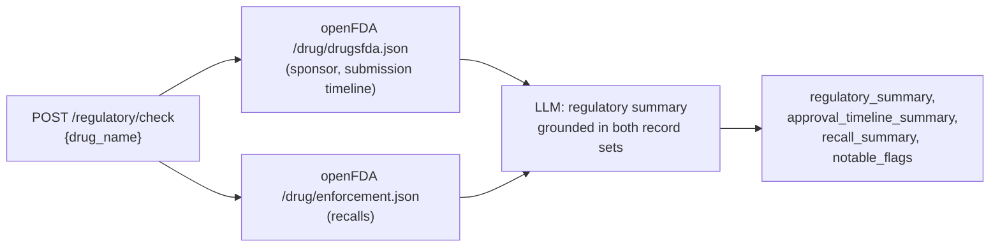

`RegulatoryAgent` reads openFDA's `drugsfda` endpoint (sponsor, dosage
form, and the full submission history — original approval plus every
supplement, each dated and typed) and `enforcement` (recalls, with
classification and reason). Verified live on Keytruda: correctly surfaced
Merck as sponsor, the real 2014-09-04 original approval date, 127
historical submissions, and zero recalls. Included in the orchestrator's
fan-out (it takes a single drug-name query, like the other specialist
agents) and in Evidence Synthesis's condensed input.

## 10. Drug-drug interaction checker

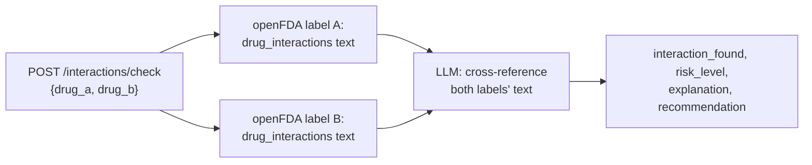

RxNav used to offer a structured pairwise drug-interaction API; NLM
discontinued it (confirmed: now returns `404`), and there's no other free,
no-key source for structured interaction data. `DrugInteractionAgent`
instead fetches both drugs' FDA label `drug_interactions` text and has the
LLM cross-reference them — explicitly framed in both the system prompt and
the UI as a text-based label comparison, not a query against a dedicated
interaction database. Verified live on warfarin + aspirin: correctly
identified the real, clinically significant interaction, citing the
specific "Table 3" drug-interaction table from warfarin's actual label.

## 11. Comparative research analysis

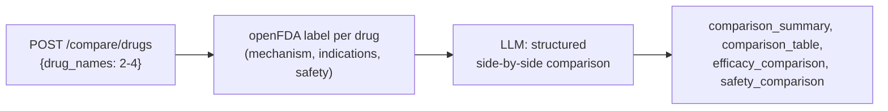

`ComparativeAnalysisAgent` fetches each drug's label independently, then
asks the LLM to compare them across mechanism, indications, and safety in
one pass — grounded only in the fetched data, not general knowledge about
drugs whose data wasn't provided. Verified live on metformin vs.
glipizide: correctly distinguished their different mechanisms
(hepatic-glucose-production vs. insulin-secretion) and safety profiles
(metformin's lactic acidosis risk vs. glipizide's hypoglycemia/leukopenia
risk), all traceable to the real label text.

## 12. News aggregation

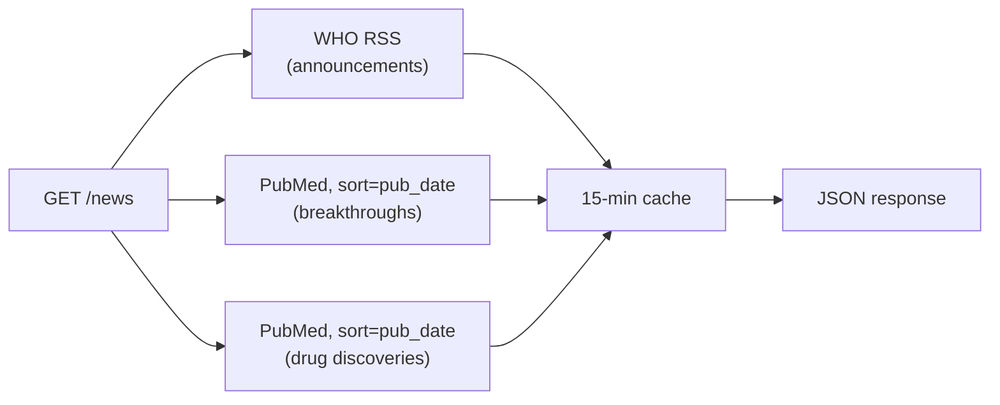

Each of the three sources is fetched independently and a failure in one is
isolated, so a bad upstream feed doesn't blank the other two. FDA and NIH's
own feeds block scripted access from this environment, so WHO stands in as
the government/health-authority source. Article dates use PubMed's
`epubdate` (real online date), not `pubdate` — a journal-citation field
NLM placeholders to Dec 31 for continuous-publication journals awaiting a
final issue.

## 13. Knowledge graph

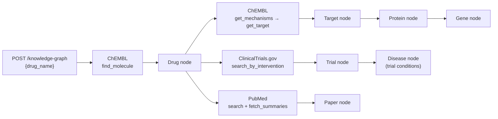

The only agent with no LLM step — the graph of real, grounded relationships
*is* the output. Verified end-to-end for "aspirin": 28 nodes / 29 edges,
correctly resolving both COX-1 and COX-2 (their real genes and proteins), 8
trials with their conditions, and 6 papers, in a few seconds.

The frontend renders `{nodes, edges}` with a **deterministic column
layout**, not a physics simulation: node types form a fixed pipeline (gene
→ protein → target → drug → trial/paper → disease), so each type gets one
column in that order, and edges are drawn as straight arrows between them
(`KnowledgeGraphView.tsx`). Reads left-to-right like a flowchart, no
crossing/jitter, and every part of the layout is hand-written and
inspectable rather than a black-box library.

## 14. External integrations

| Source | Used by | Auth |
|---|---|---|
| PubMed E-utilities | Literature Review, Citation Generator, News, Knowledge Graph, Research Paper Analyzer | none (optional key/email for higher rate limits) |
| ClinicalTrials.gov v2 | Clinical Trial Analyzer, Knowledge Graph | none |
| openFDA (label) | Drug Discovery, Safety, Drug Interaction Checker, Comparative Analysis | none |
| openFDA (FAERS events) | Safety | none |
| openFDA (drugsfda / approvals) | Regulatory Intelligence | none |
| openFDA (enforcement / recalls) | Regulatory Intelligence | none |
| RxNav / RxNorm | Drug Discovery | none |
| ChEMBL | Knowledge Graph (drug → target → protein → gene) | none |
| WHO news RSS | News (announcements) | none |
| Wikipedia (search + page summary API) | Web Search RAG (global widget) | none |
| DuckDuckGo Instant Answer API | Web Search RAG (global widget) | none |
| Ollama (local) | LLM synthesis (`llama3.2`) + embeddings (`nomic-embed-text`) | none — local server |
| Anthropic API | LLM synthesis, alternative to Ollama | `ANTHROPIC_API_KEY` |
| Chroma | Vector store (PubMed abstracts + uploaded document chunks; Document Q&A retrieves from here) | none — local, file-persisted |

## 15. Configuration

Driven entirely by `backend/.env` (see `backend/.env.example`), read via
`app/core/config.py`. Key switches:

- `LLM_PROVIDER` — `ollama` (default, no key) or `anthropic`
- `EMBEDDING_PROVIDER` — `ollama` (default, semantic, no extra install),
  `hash` (dependency-free bag-of-words, weak retrieval), or
  `sentence_transformers` (optional heavy dependency)
- `VECTOR_STORE_PROVIDER` — `chroma` (only one implemented)

Frontend: `frontend/.env.local` sets `VITE_BACKEND_URL`, baked in at build
time (Vite), not read at container runtime.

## 16. Known limitations

- **No persistence** — `db/session.py` configures a SQLAlchemy engine and
  `DATABASE_URL` points at Postgres, but there are no ORM models and no
  route uses the `get_db()` dependency. Every result is lost on refresh.
- **No authentication** — `JWT_SECRET_KEY` is configured but unused; every
  endpoint is open.
- **Cache is in-process memory** — resets on restart, not shared across
  multiple backend workers/instances.
- **News "government announcements" is WHO-only** — FDA and NIH's own feeds
  block scripted access from this environment.
- **Knowledge graph is drug-centric only** — it takes a drug name and fans
  out to target/protein/gene, trials/diseases, and papers. It doesn't yet
  support starting from a disease or gene name.
- **Citation Verification is LLM-judging-LLM, not a formal entailment
  check** — it catches clearly unsupported claims (verified live) but isn't
  a substitute for a human checking the underlying sources.
- **No research trend / competitive intelligence** — deliberately not
  built yet; it inherently needs time-series data, which is blocked on the
  "no persistence" gap above rather than being a separate missing feature.
- **Drug-Drug Interaction Checker is a label text cross-reference, not a
  dedicated interaction database** — RxNav's structured interaction API is
  confirmed discontinued by NLM (`404`), and there's no other free, no-key
  alternative, so this reads both drugs' FDA label text and has the LLM
  compare them. Real, but weaker than a purpose-built interaction database
  — always verify with a pharmacist.
- **No audience-selectable summaries** — Research Summarizer produces one
  fixed set of outputs (one-page/executive/findings/implications), not a
  chooseable researcher-vs-clinician-vs-lay tone.
- **Comparative Analysis and Research Paper Analyzer aren't in the
  orchestrator** — both take a different input shape than the other
  specialist agents (a drug list, or a PMID/text) and are standalone-only
  with their own panels.
- **Web Search RAG's grounding isn't airtight** — Wikipedia's search API
  matches keyword-style queries much better than natural-language
  questions, and the local LLM doesn't always decline to answer when the
  retrieved excerpts are actually insufficient; it does self-report a
  `confidence` level, which is a partial (not complete) mitigation.

## 17. Deployment

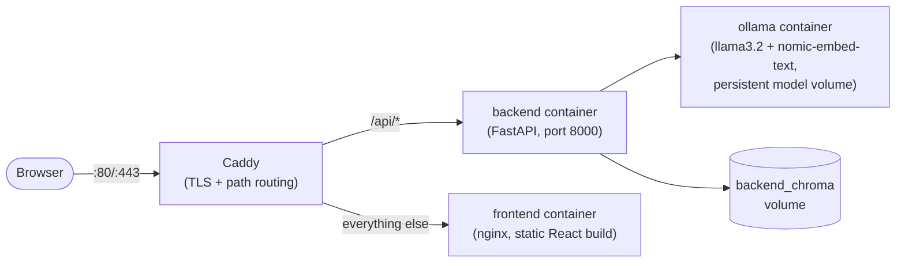

`docker-compose.prod.yml` (distinct from the plain `docker-compose.yml`
used for local dev, which expects `ollama serve` on the host machine) runs
the whole stack self-contained: Ollama as its own container rather than a
host dependency, a one-shot `ollama-init` service that pulls both models
on first boot (a no-op on every boot after), and Caddy as the single public
entry point so the frontend and backend share one origin — the browser
only ever calls a relative `/api/v1/...` path, so CORS doesn't come into
play in normal use. Postgres isn't part of the prod stack since nothing in
the app actually uses it yet (see the limitation above).

Deployed to a standalone Google Cloud project (isolated from any other
project on the account) via a single Compute Engine VM — no managed
container service, since self-hosting Ollama needs a persistent, always-on
process with real RAM, not a scale-to-zero container. See `DEPLOY.md` for
the exact commands to redeploy, add a custom domain (free HTTPS via
Caddy's automatic Let's Encrypt), check logs, or tear the whole thing down.
